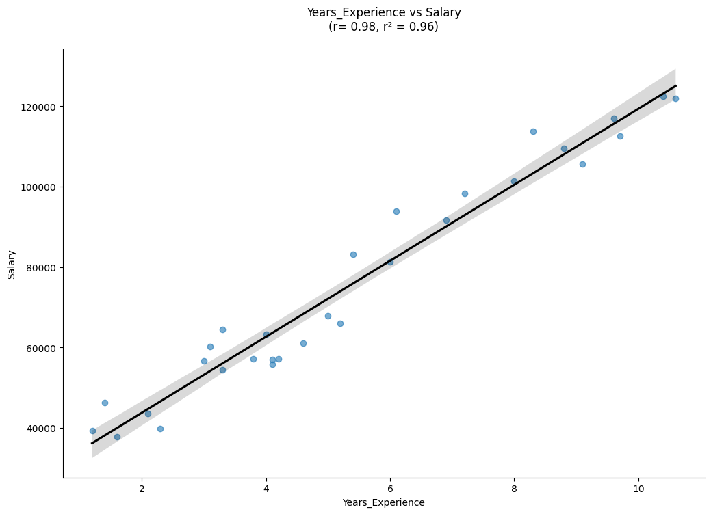

# 100 Day Coding Challenge - Day 1: Salary Data Analysis

## Introduction
To refresh and strengthen my data skills, I am committed to do a "100 Days of Coding Journey" with projects that provides insights on real world questions or lessions to improve understanding of everyday topics or tools. I will work with different datasets and databases to create small, focused projects to enhance my skills in Python, SQL, and Machine Learning. My goal is to maintain my momentum in my data learning journey and reflect on my improvements and new-found skills. 

## Background

This project uses a sample dataset containing employee salary information based on experience. The goal is to take the information and visualize the relationship using a scatter plot as well as find the correlation of the variables. This lesson should provide a foundational step towards more advanced regression modeling. 

## Tools I Used

* <b> Python </b> - the foundation of my project, used for data extraction via API requests, data cleaning, and visualization.
* <b> VSCode </b> - the code editor for developing and managing the project environment.
* <b> Kaggle </b>  - the data source and community platform used to access and download the dataset using its API feature.
* <b> Pandas </b>  - the Python library used for reading and cleaning the dataset for analysis.
* <b> Matplotlib and Seaborn </b> - visualization libraries used to plot, explore, and present insights through clear and informative visuals.
* <b> Git and Github </b> - Essential for version control, project tracking, and collaboration.

## The Analysis

The following information was noted from our review of the sample dataset:

1. The sample contains 30 employees records with years of experience ranging from 1.2 to 10.6 years.
2. Salary information:  
    * Average salary: $76,004  
    * Lowest salary: $37,732  
    * Highest salary: $122,392  
3. Based on our analysis, there appears to be a strong correlation between years of experience and salary, indicating that compensation tends to increase with professional experience.

## Conclusion

This project allowed me to reinforce various data concepts and tools, including data cleaning, visualization, and exploratory analysis. I gained a deeper understanding of how to leverage powerful Python libraries while strengthening my ability to identify correlations and interpret data insights. These skills should help me prepare for more advanced projects - such as machine learning projects - as well as enhance my ability to write clear analytical reports and deliver effective data presentations.