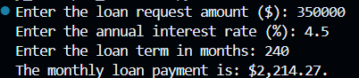

# 100 Day Coding Challenge - Day 2: Simple Monthly Loan Payment Calculator

## Introduction

As a professional in the banking industry, I have learned that understanding foundational banking concepts can help with developing powerful programs that automate processes and deliver meaningful insights. The banking industry not only introduced me to analytics but also sparked a passion for leveraging data to solve real-world problems. While I have an interest in other industries, I am committed to continued growth and advancement in the banking industry and improving my technical skills using banking concepts and ideas. 

## Background

This project presents a simple, yet practical loan payment calculator which computes monthly payments based on a loan's principal balance, fixed interest rate, and term length in months. This tool offers a fast and reliable way to determine monthly loan payments without the need for manual calculation of monthly loan payments.

## Tools I Used

* <b> Python </b> - the foundation of my project, used to define and execute the loan payment calculations efficiently and accurately.
* <b> VSCode </b> - the code editor for developing and managing the project environment.
* <b> Terminal </b> - used for direct script execution and environment control to ensure seamless interaction between the code and system.
* <b> Git and Github </b> - essential for version control, project tracking, and collaboration.

## The Analysis

The following code was developed to perform the monthly loan payment calculations for this project:

```Python
# Define calculation parameters
def calculate_monthly_loan_payment(principal, annual_interest_rate, months):
    i = (annual_interest_rate / 100) / 12
    n = months
    return principal * (i * (1 + i)**n) / ((1 + i)**n - 1)

# Input loan request
loan_amount = int(input('Enter the loan request amount ($): '))
rate = float(input('Enter the annual interest rate (as a float): '))
months = int(input('Enter the loan term in months: '))

# Calculate payment information
monthly_payment = calculate_monthly_loan_payment(loan_amount, rate, months)

# Output calculation
print(f'The monthly loan payment is: ${monthly_payment:,.2f}.')
```
To streamline the process as well as promote reusability, I defined a function which automates the monthly loan payment calculation. The function parameters include the loan's principal balance, annual interest rate, and term length in months.

This project is designed to be interactive, allowing user to input loan details and instantly calculate monthly loan payments without manual calculation.

Example Test:



For a loan amount of $350,000 at a fixed interest rate of 4.5% and loan term of 240 months, the calculated monthly payment is $2,214.27.

## Conclusion
This project reinforced Python concepts, such as defining a function and critical thinking on the monthly loan payment formula to perform calculations. Beyond this project, this project can be reused as an efficient way to calculate fixed-rate loans. Future enhancements to this project could include integrating ARM structure rates or developing a loan amortization schedule to expand functionality and provide further financial insights.