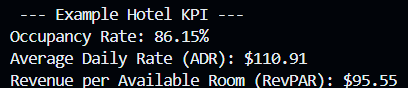

# 100 Day Coding Challenge - Day 3: Simple Hotel KPI Calculator

## Introduction

Prior to my current career in banking, I had multiple years of experience managing hotels. Hotel managers are responsible for the daily operations of the hotel and must be heavily involved in the front and back end of hotel performance. A general, yet important concept hotel managers must understand is key performance indicators (KPIs), such as hotel occupancy, the average rate the hotel rooms were sold for, and revenue generated from the sale of rooms.

## Background

This project presents a simple, yet practical hotel KPI calculator that displays hotel KPI results based on total hotel rooms, sold hotel rooms, and room revenue. Users will find this tool useful to quickly summarize hotel performance results without needing to calculate the results manually. 

## Tools I Used

* <b> Python </b> - the foundation of my project, used to define and execute the loan payment calculations efficiently and accurately.
* <b> VSCode </b> - the code editor for developing and managing the project environment.
* <b> Terminal </b> - used for direct script execution and environment control to ensure seamless interaction between the code and system.
* <b> Git and Github </b> - essential for version control, project tracking, and collaboration.

## The Analysis

The following code was developed to perform the hotel KPI calculations for this project:

```Python
# Define the Hotel Name
hotel_name = str(input('What is the name of the hotel: '))

# Define inputs
total_rooms = float(input('How many rooms does the hotel have: '))
rooms_sold = float(input('How many hotel rooms were sold: '))
hotel_revenue = float(input('Enter the total room revenue generated ($): '))

# Calcuate KPIs with room information inputs
occupancy = (rooms_sold / total_rooms) * 100
adr = hotel_revenue / rooms_sold
revpar = adr * (occupancy / 100)

# Display KPI results

print(f"\n --- {hotel_name} KPI --- ")
print(f'Occupancy Rate: {occupancy:.2f}%')
print(f'Average Daily Rate (ADR): ${adr:.2f}')
print(f'Revenue per Available Room (RevPAR): ${revpar:.2f}')
```
To streamline the process as well as promote reusability, allow the user to input the name of the hotel, total rooms in inventory, the total amount of rooms sold, and how much revenue the hotel generated. This project is designed to be interactive, allowing user to input hotel performance information and instantly important hotel KPIs such as occupancy, ADR, and RevPAR.

Example Test:



For Example Hotel, the hotel was able to generate $12,422 based on 112 rooms sold out of the 130 available. This means that the hotel reported an occupancy rate of 86.15%, ADR of $110.91, and RevPAR of $95.55.

## Conclusion
This project reinforced Python concepts, such as creating variables that would calculate inputted hotel information. Hotels may find this calculator useful for quick KPI information. Future enhancements to this project could include integrating comparing other examples hotels for competition analysis or inspiration to create visualizations of KPI information.